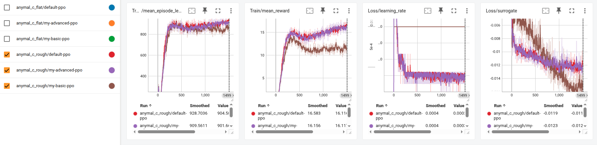

# Advanced PPO for Quadruped Locomotion in Isaac Lab

This repository showcases the development and enhancement of a Proximal Policy Optimization (PPO) agent for training a quadruped robot. The project leverages the high-fidelity NVIDIA Isaac Lab simulation environment and the RSL-RL library to teach complex walking behaviors.

The core of this work involves a systematic, from-scratch implementation and enhancement of the PPO algorithm, demonstrating a deep understanding of both reinforcement learning theory and high-performance code.

## Project Overview
The goal of this project is to train a high-performing locomotion policy for an ANYmal-C quadruped robot. Starting with the foundational rsl_rl library, this work dissects the standard PPO algorithm and rebuilds it step-by-step. The final result is a custom agent incorporating state-of-the-art techniques that successfully matches the performance of the highly optimized, production-grade implementation.

### Key Objectives:
- Implement PPO from First Principles: Re-create the core PPO algorithm to gain a deep understanding of its components, including the clipped surrogate objective, value function loss, and advantage estimation.
- Systematic Enhancement: Incrementally add advanced, state-of-the-art techniques to the baseline PPO to improve its performance and stability.
- Rigorous Analysis: Use TensorBoard to conduct comparative experiments, validating the impact of each algorithmic enhancement against the baseline and the original library implementation.

## Algorithmic Contributions
This project's main contribution is the step-by-step implementation of a PPO agent, validating the impact of several key techniques:

### 1. Foundational PPO Implementation
A baseline PPO agent was built from scratch, including:
- The core PPO clipped surrogate objective, value objective, and regularized entropy term.
- Essential stability tricks such as advantage normalization, clipped value loss, and gradient clipping.

### 2. Adaptive Learning Rate Schedule
To improve stability and convergence speed, a KL-adaptive learning rate schedule was implemented.
- The learning rate is dynamically adjusted based on the KL-divergence between the old and new policies.
- This allows the agent to take larger, more confident steps when the policy is stable and smaller, more cautious steps during periods of high change, preventing training collapse.

## Result Analysis
This analysis is based on training three different PPO implementations on both flat and rough terrain environments.

**Flat Terrain Performance**


The above graph presents a comparison between three different agent implementations on the Isaac-Velocity-Flat-Anymal-C-v0 task.
- Blue Line: The original, highly optimized PPO from the rsl_rl library. This serves as our performance baseline.
- Green Line: Our from-scratch "basic" PPO implementation, including essential stability tricks.
- Orange Line: Our enhanced PPO, which adds the adaptive learning rate schedule to the basic version.

Key Findings:
- Validation: The results on flat terrain clearly validate our development process. Our Basic PPO (green) learns the task successfully but is noticeably less sample-efficient than the Original PPO (blue).
- Impact of Adaptive LR: Our Advanced PPO (orange), which incorporates the adaptive learning rate, almost perfectly closes this performance gap. Its learning curve and final reward closely match the original, highly optimized implementation, confirming that this technique is critical for achieving top-tier performance.

**Rough Terrain Performance**

The above graph presents a comparison between three different agent implementations on the Isaac-Velocity-Rough-Anymal-C-v0 task.
- Red Line: The original, highly optimized PPO from the rsl_rl library. This serves as our performance baseline.
- Brown Line: Our from-scratch "basic" PPO implementation, including essential stability tricks.
- Purple Line: Our enhanced PPO, which adds the adaptive learning rate schedule to the basic version.

Key Findings:
- Increased Difficulty: As expected, the learning problem is significantly harder on rough terrain. All agents achieve a lower final Train/mean_reward compared to their flat-terrain counterparts. This is because the optimal policy for rough terrain requires a more cautious and stable gait, which naturally results in lower forward velocity (a key component of the reward).
- Amplified Performance Gap: The difference between the implementations is even more pronounced here. Our Basic PPO (brown) struggles significantly, converging to a much lower reward. The Original (red) and our Advanced PPO (purple) are again closely matched, demonstrating that the stability provided by the adaptive learning rate is even more crucial when the task is complex and challenging.

**Putting Together**

Overall Conclusion
- The experiments successfully demonstrate a systematic approach to algorithm development. We began with a functional but suboptimal baseline and, by adding a single state-of-the-art technique (adaptive learning rate), we were able to match the performance of a production-grade library on both simple and complex tasks.
- The results also highlight the trade-offs in curriculum design: while training on flat terrain is faster and yields higher "top speed" rewards, the policy learned may not be robust enough for more complex scenarios. Training on rough terrain is slower but produces a more versatile and robust agent.

**Video Play**

https://github.com/huangfq07/IsaacLab-Quadruped-Locomotion/blob/main/tough_terrain.gif
https://github.com/huangfq07/IsaacLab-Quadruped-Locomotion/blob/main/tough_terrain_2.gif

## Repository Structure
To showcase the work clearly, this repository contains:
- /logs: 
- .png: Contains screenshots of TensorBoard graphs and videos of the trained agent's performance.
- README.md: This file.
- The modified PPO algorithm lives in a fork of the rsl_rl library, which can be found here: https://github.com/huangfq07/rsl_rl

## Setup & Usage
This project builds upon the NVIDIA Isaac Lab ecosystem.
1. Setup Isaac Lab: Follow the official Isaac Lab installation documentation to set up the simulator and the conda environment.
2. Install Modified RSL-RL: To use the custom PPO agent, install it from the forked repository.
```
# Activate the conda environment
conda activate env_isaaclab

# Install the modified library directly from your forked GitHub repo
pip install git+https://github.com/huangfq07/rsl_rl.git
```
3. Run Training: Launch the training script using the provided Isaac Sim python environment. Remember to source the setup script first.
```
# From a new terminal
conda activate env_isaaclab
source /path/to/isaac_sim/setup_conda_env.sh

# Run the training script from the IsaacLab directory
./isaaclab.sh -p scripts/reinforcement_learning/rsl_rl/train.py --task=Isaac-Velocity-Flat-Anymal-C-v0 --headless
```
Visualize Results:
```
tensorboard --logdir logs/rsl_rl
```
